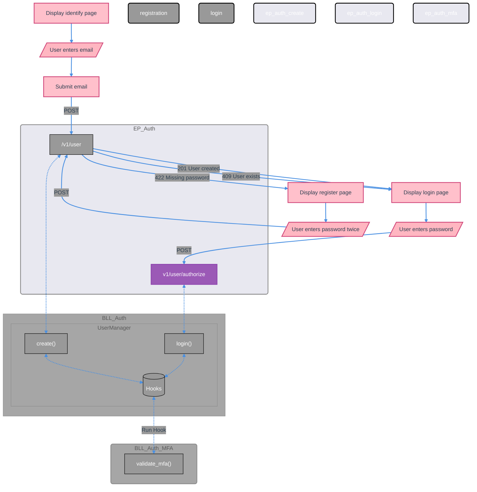

# Authentication & Authorization System

This document outlines the comprehensive authentication and authorization system implemented in the BLL layer.

## Core Components

### User Management
- **UserManager** - Core user CRUD operations with metadata support
- **UserCredentialManager** - Password management with history tracking
- **UserRecoveryQuestionManager** - Security questions for account recovery
- **UserMetadataManager** - User preferences and additional data
- **SessionManager** - Active session management
- **FailedLoginAttemptManager** - Login failure tracking and account security

### Team & Role Management
- **TeamManager** - Team CRUD with hierarchical support and metadata
- **TeamMetadataManager** - Team-specific configuration and settings
- **RoleManager** - Role-based access control with inheritance
- **UserTeamManager** - User-team-role relationships
- **PermissionManager** - Fine-grained resource permissions

### Invitation System
- **InvitationManager** - Team invitation management
- **InviteeManager** - Individual invitation tracking




## Authentication Methods

### JWT Token Authentication
```python
# Token generation
token = UserManager.generate_jwt_token(user_id, email, expiration_hours=24)

# Token verification  
UserManager.verify_token(token, db)

# Authorization header format
Authorization: Bearer <jwt_token>
```

### Basic Authentication
```python
# Authorization header format
Authorization: Basic <base64(email:password)>

# Supports both email and username
user@example.com:password
username:password
```

### API Key Authentication
```python
# For system-level access
Authorization: Bearer <root_api_key>
X-API-Key: <api_key_header>
```

## User Management

### User Creation & Registration
```python
user_manager = UserManager(
    model_registry=model_registry,
    requester_id=requester_id
)

# Standard user creation
user = user_manager.create(
    email="user@example.com",
    username="username",
    password="secure_password",
    first_name="John",
    last_name="Doe"
)

# Registration with invitation acceptance
user = user_manager.create(
    email="user@example.com",
    password="secure_password",
    invitation_code="ABC12345"
)
```

### Password Management
```python
# Password change with verification
credentials_manager.change_password(
    user_id=user_id,
    current_password="old_password",
    new_password="new_password"
)

# Password verification
is_valid = user_manager.verify_password(user_id, password)
```

### User Metadata & Preferences
```python
# User metadata stored as key-value pairs in UserMetadataModel
# Accessed through UserMetadataManager

metadata_manager = UserMetadataManager(
    model_registry=model_registry,
    requester_id=requester_id
)

# Create metadata entry
metadata_manager.create(
    user_id=user_id,
    key="theme",
    value="dark"
)

# Get metadata entries
metadata_list = metadata_manager.list(user_id=user_id)
```

## Team Management

### Team Creation
```python
team_manager = TeamManager(
    model_registry=model_registry,
    requester_id=requester_id
)

# Create team with metadata
team = team_manager.create(
    name="Development Team",
    description="Software development team",
    parent_id=parent_team_id,  # Optional hierarchical structure
    custom_setting="value"     # Stored as team metadata
)
```

### Team Membership Management
```python
user_team_manager = UserTeamManager(
    model_registry=model_registry,
    requester_id=requester_id
)

# Add user to team with role
membership = user_team_manager.create(
    user_id=user_id,
    team_id=team_id,
    role_id=role_id,
    enabled=True
)

# Update user role in team
user_team_manager.patch_role(
    user_id=user_id,
    team_id=team_id,
    body={"role_id": new_role_id}
)
```

## Role-Based Access Control

### Role Management
```python
role_manager = RoleManager(
    model_registry=model_registry,
    requester_id=requester_id
)

# System-wide role (team_id=None)
system_role = role_manager.create(
    name="admin",
    friendly_name="Administrator",
    mfa_count=2,
    password_change_frequency_days=90
)

# Team-specific role
team_role = role_manager.create(
    name="team_lead",
    friendly_name="Team Leader", 
    team_id=team_id,
    parent_id=system_role_id  # Inherits from system role
)
```

### Permission System
```python
permission_manager = PermissionManager(model_registry=model_registry, requester_id=requester_id)

# User-specific permission
user_permission = permission_manager.create(
    resource_type="document",
    resource_id=document_id,
    user_id=user_id,
    can_view=True,
    can_edit=True
)

# Team-wide permission
team_permission = permission_manager.create(
    resource_type="project",
    resource_id=project_id,
    team_id=team_id,
    can_view=True,
    can_execute=True
)

# Role-based permission
role_permission = permission_manager.create(
    resource_type="system",
    resource_id="admin_panel",
    role_id=admin_role_id,
    can_view=True,
    can_edit=True,
    can_delete=True
)
```

## Invitation System

### Team Invitations
```python
invitation_manager = InvitationManager(model_registry=model_registry, requester_id=requester_id)

# Public invitation with code
invitation = invitation_manager.create(
    team_id=team_id,
    role_id=role_id,
    max_uses=10,
    expires_at=datetime.now() + timedelta(days=7)
)

# Direct email invitation
invitation_link = invitation_manager.add_invitee(
    invitation_id=invitation.id,
    email="invitee@example.com"
)
```

### Invitation Acceptance
```python
# Accept via invitation code
result = invitation_manager.accept_invitation_unified(
    accept_data=InvitationModel.Accept(invitation_code="ABC12345"),
    user_id=user_id
)

# Accept via invitee ID (email invitation)
result = invitation_manager.accept_invitation_unified(
    accept_data=InvitationModel.Accept(invitee_id=invitee_id),
    user_id=user_id
)
```

## Security Features

### Login Security
```python
# Failed login tracking
failed_login_manager = FailedLoginAttemptManager(model_registry=model_registry, requester_id=requester_id)

# Check if account is locked
is_locked = failed_login_manager.is_account_locked(
    user_id=user_id,
    max_attempts=5,
    hours=1
)

# Count recent failed attempts
recent_failures = failed_login_manager.count_recent(user_id, hours=1)
```

### Session Management
```python
session_manager = SessionManager(model_registry=model_registry, requester_id=requester_id)

# Create session
session = session_manager.create(
    user_id=user_id,
    session_key=session_key,
    jwt_issued_at=datetime.now(),
    device_type="web",
    browser="Chrome",
    expires_at=datetime.now() + timedelta(days=30)
)

# Revoke session
session_manager.revoke_session(session_id)

# Revoke all user sessions
revoked_count = session_manager.revoke_sessions(user_id)
```

### Recovery Questions
```python
recovery_manager = UserRecoveryQuestionManager(model_registry=model_registry, requester_id=requester_id)

# Create recovery question
question = recovery_manager.create(
    user_id=user_id,
    question="What was your first pet's name?",
    answer="fluffy"  # Automatically hashed
)

# Verify answer
is_correct = recovery_manager.verify_answer(question_id, "fluffy")
```

## Authentication Flow

### Login Process
```python
# Complete login with multiple authentication factors
login_result = UserManager.login(
    login_data={
        "email": "user@example.com",
        "password": "password"
    },
    ip_address="192.168.1.1",
    req_uri="https://app.example.com"
)

# Returns:
{
    "id": "user_id",
    "email": "user@example.com", 
    "token": "jwt_token",
    "teams": [{"id": "team_id", "name": "Team Name", "role_name": "Admin"}],
    "detail": "https://app.example.com?token=jwt_token",
    # ... user preferences
}
```

### Authorization Middleware
```python
# FastAPI dependency for route protection
user = UserManager.auth(authorization=header, request=request)

# Bypasses auth for user registration
# Supports Bearer tokens, Basic auth, and API keys
# Validates user account status and permissions
```

## Search Abilities

All managers support advanced search with transformers:

```python
# User search with name transformer
users = user_manager.search(name="john")  # Searches first_name, last_name, display_name, username

# Role search with system role filter  
roles = role_manager.search(is_system=True)  # Finds system-wide roles

# Failed login search with time-based transformer
recent_failures = failed_login_manager.search(recent=24)  # Last 24 hours
```

## Data Models

### Core Model Structure
All authentication entities follow the standard model pattern:

- **Entity Model** - Main data structure with validation
- **ReferenceModel** - For relationship handling  
- **NetworkModel** - API request/response formats
- **Create/Update/Search** - Operation-specific schemas

### Model Mixins Used
- `ApplicationModel` - ID, creation tracking
- `UpdateMixinModel` - Update tracking
- `UserModel.ReferenceID` - User relationships
- `TeamModel.ReferenceID` - Team relationships  
- `RoleModel.ReferenceID` - Role relationships

## Business Logic Validation

### Cross-Entity Validation
- User email/username uniqueness
- Team membership validation
- Role inheritance checking
- Permission ownership validation
- Invitation expiration and usage limits

### Security Validation
- Password complexity requirements
- Failed login attempt limits  
- Session expiration handling
- Multi-factor authentication support
- Account status verification
